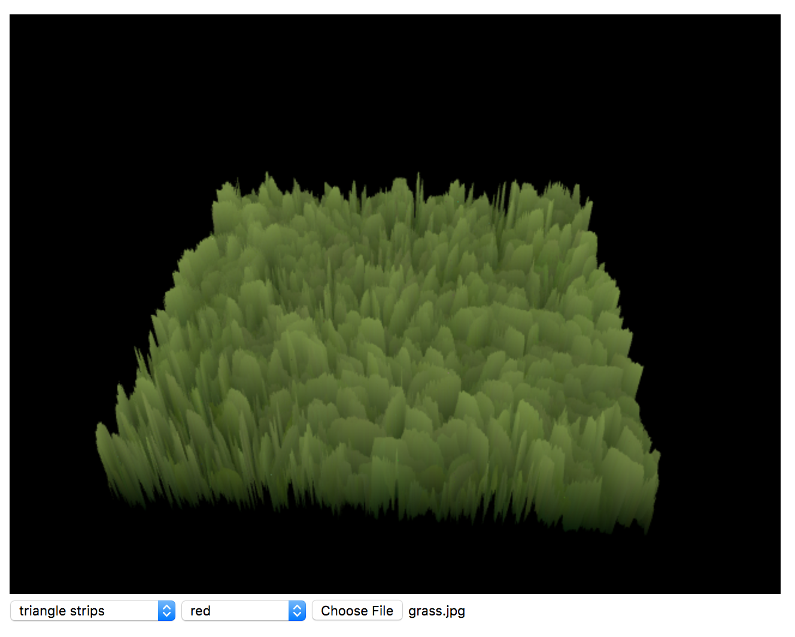

# WebGL Image Heightfield

This web application renders the heightfield of an input image given a geometric primitive and a color channel, which represents the height

Input Image                | Heightfield
:-------------------------:|:-------------------------:
  |  

## Demo
You can test the app at https://trulyfonz.github.io/webgl_heightfield/

## Features
- Intuitive camera control with mouse
- Maps a RGB color channel to height
- Renders with various geometric primitives
  - Triangle strips
  - Triangles
  - Lines
  - Points
- Orients camera using parameters derived from [Ritter's bounding sphere algorithm](https://en.wikipedia.org/wiki/Bounding_sphere#Ritter.27s_bounding_sphere)

## Limitations
- Performance is not optimized for large images
- The WebGL extension for 32-bit unsigned integer (uint) indices may not be available on some platforms and thus relatively large images may not be properly rendered. If the extension is indeed not available, the program defaults to 16-bit uint indices, which is supported by WebGL 1.0
- Among the geometric primitives, lines and triangle strips usually achieve the slowest and fastest rendering speeds, respectively

## Built With
- [WebGL](https://developer.mozilla.org/en-US/docs/Web/API/WebGL_API) - JavaScript API for rendering interactive 3D and 2D graphics
- [Sylvester](http://sylvester.jcoglan.com/) - JavaScript API for vector and matrix math

## Author
Alfonso Castellanos

## License
MIT @ [Alfonso Castellanos](https://github.com/TrulyFonz)

## Acknowledgements
- Professor Jernej Barbic for his [computer graphics class](http://www-bcf.usc.edu/~jbarbic/cs420-s17/)
- Khronos Group and Google for their [camera controller module](https://github.com/KhronosGroup/WebGL/blob/master/sdk/demos/google/resources/cameracontroller.js)
